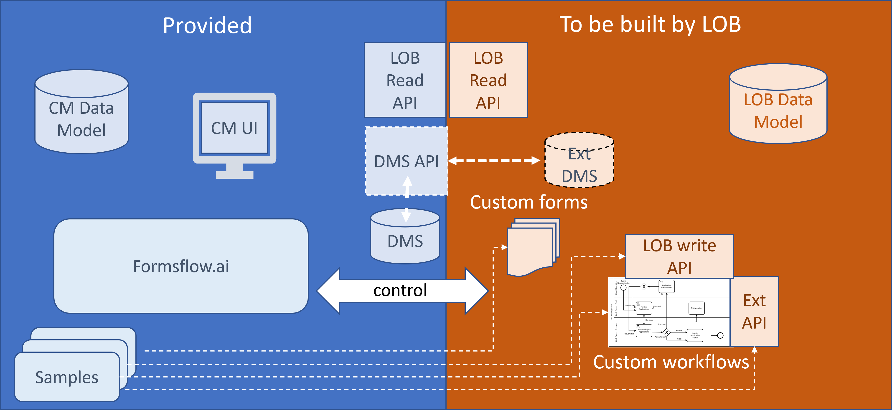
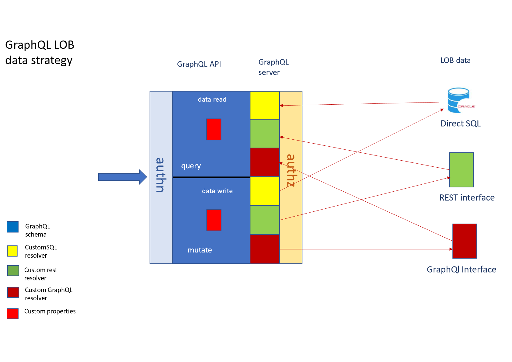
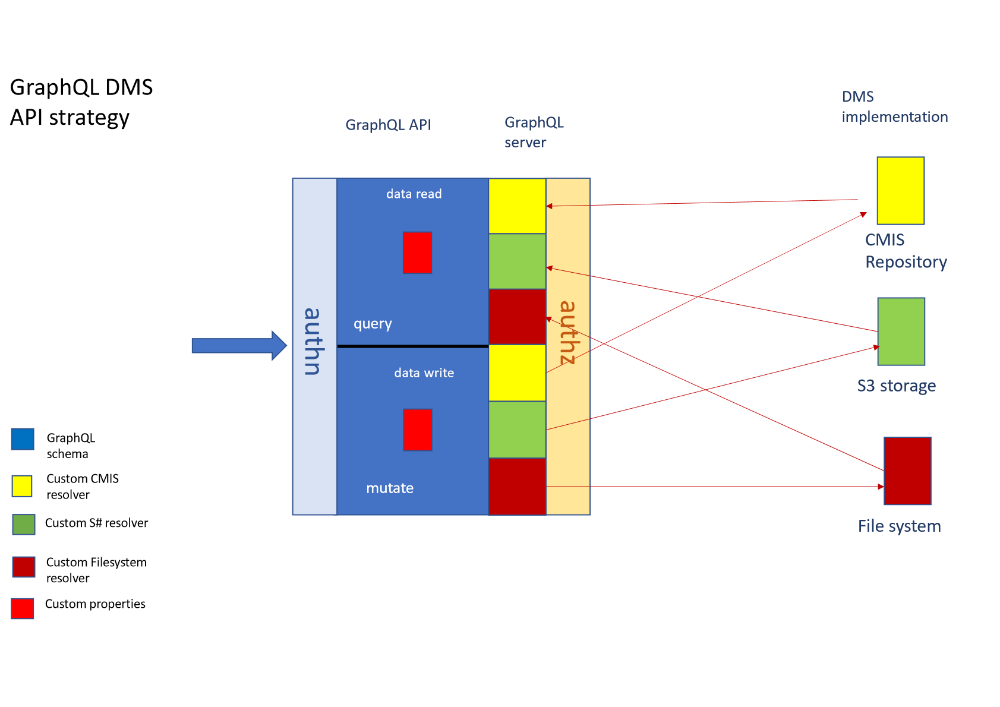

# Introduction
Case Flow is an open-source generic Case Managment application built on top of formsflow.ai

The application is explicitly designed to be hightly generic and configurable. There are 4 fundamental design tenets which describe our philosophy :
- No assumptions are made about the line-of-business ("LOB") for which the application provides case managment functionality. Typical case management applications assume a particular vertical and are internally tailored out-the-box for this vertical, for example insurance claims or police investigations or complaint management. Case Flow allows the user to bring their own data model, whether legacy or custom, into the application. In other words, providing a Case Management layer around an existing data model. 
- Case data is built up incrementally through the case process on an "as-needs" basis through the presentation of forms associated with user tasks. In other words, users with appropriate privileges are assigned tasks which have associated forms which allow input of data which add to the case record. Complex searches and/or maintenance of related data such as user, financial or historic data is typically the province of the LOB custom or legacy application, not Case Flow.
- Writing to LOB databases is the responsibility of workflow tasks. Reading from LOB databases is through form components (eg. drop-down selections) or Case Flow UI listeners which can be configured to update on display of defined areas.
- Case data can be stored in the LOB or the Case Flow case database, or both depending on requirements. This provides a clear migration capability if needed. Form and workflow data is normally stored in cache fashion until a permanent home is found in LOB or case data stores.


The application also caters for greenfield Case Management applications including the provision of local Document Managment functionality and a sample LOB.

Specifically , Case Flow provides :

- A **React/Vue.js UI** which integrates the case management and LOB components of the solution
- Tight integration to **workflow, forms and reports** through formsflow.ai
- Ability to configure the display of **LOB and case data** with no coding
- Careful **maintenance of context** throughout the application
- Hooks to seamlessly **integrate stand-alone LOB applications**(typically used to search and maintain LOB data) as if from the same application. 
- Callbacks to facilitate the **updating of LOB data** througn workflow

A typical implementation scenario is:

- Install and configure Formsflow.ai and Case Flow according to these instructions <<add links>>
- Decide and set up what data is needed from the LOB in each of the UI areas of Case Flow
- Decide on what data flows from forms to workflow, local cache,LOB, local permanent case data or external systems
- Create the forms and workflows necessary to manage the flow of cases through the system 
- Define the mappings for persisting cache data through the LOB API to the LOB, and add the listeners for this to the appropriate workflow steps
- Define and create the integrations to third-party API's as workflow modules (if needed)
- Configure the DMS API to either use the LOB DMS or configure the local DMS function
- Refactor existing applications to allow seamless inclusion in the Case Flow UI. This requires single sign-on and adaptation according to the following instructions <<insert>>

The diagram below illustrates the clear differentiation between what Case Flow provides and what needs to be provided by the LOB :




# The UI


## Step 1 - Define data flow
An important part of any solution is to understand where data originates, where it flows and where it ultimately ends up. Broadly speaking, data "belongs" to one of the followng entities :
- formsflow.ai - Form and Workflow cache only
- Case Flow - Case data
- LOB - LOB data
- DMS - Documents (which may be stored in Case FLow internal DMS or the LOB accessible DMS)

Please refer to the following diagram for an overview of the data flows relevant to Case Flow :
    


#### Public/initiator data 
A case is normally started through an event  typically initiated by a public user. WIth legacy inputs such as email, chat or phone, the data would normally be entered into the system by mailroom or call centre staff through a "case start" form. For "self-service" applications, the form may directly initiate a case upon submission.

In both these cases, the formsflow.ai product is used to define the form. In the first case, however, the form is linked to a "Case type" rather than a workflow - this is discussed in [ref]
In the second case, the form is linked to a workflow (whose main purpose is to extract data and determine what kind of case to start). Both of these scenarios are performed in the formsflow.ai form designer. 

#### Form/cache data
It is very important to clearly define and name the variables which map to fields on forms. These variable names will be used throughout the case, and should be clearly identifiable. Form fields need to be assigned to variables for them to be of any use down the track.

On submission, all form fields are saved into the Form Cache. They become available to the workflow by mapping them into the workflow cache which is done when defining a workflow OR a case start form

The workflow cache variables are all made available as "GLOBAL" workflow variables. They are referred to in workflows as blah
It is important that workflow designers understand what data they have available to them. This is much easier if variables are clearly defined.

Cache variables can be made available to the Case FLow UI - these need to be defined in the "cache-case-mapper" as follows : blah

#### Case Data

Case data is displayed and updated in the Case Flow UI, primarily. However, the case API is also available to workflows and custom LOB clients if required. Typical examples of where this might happen is where a workfow might be the final step of a case , and if successful changes the case status to "Complete".

It is possible to define custom case data - that is, data which is not part of the default case data model, and which is not part of the LOB.  (as follows)

The following diagram shows the case manager data model :


#### LOB read-only data

LOB data is usually needed to provide context to cases. A unique case identifier mapped between LOB and Case Flow allows retrieval of LOB data relevant to the case for display in both the Case Flow UI and custom reports. 

Case Flow makes no assumptions about LOB data, but DOES define clearly how it should be delivered for different use cases. It is up to the implementer to conform to this API - this is defined in [link] however in this step it is important to clearly define and understand all LOB data which will be useful to end-users on both dashboards and reports. 

Case Flow defines 4 areas where LOB data will be automatically queried and displayed (with the primary search criterion being the case ID )

- UI context pane
- UI search query parameters
- UI search result list
- Reports

#### LOB write data

Case Flow never updates LOB data - the only mechanism to do this is through workflows which are always customer-specific. However Case Flow does offer help in this regard through the provision of listeners which can be inserted into workflow steps and will map data from workflow cache to LOB provided the appropriate mappings are set up. This is described in ....

#### Knowledge worker data

This is data which is entered during the course of a case by knowledge workers (typically during a workflow and typically via a form). This may involve searching on legacy LOB or external applications, manual processes or even multiple workflows. Ultimately this data finds its way into the LOB or the Case database. Customisation options here rely on workflows and associated forms to map the correct data to LOB systems or the case data model. In any event it is essential to understand what data is available at each step of the workflow, what data is required of each knowledge worker (there may be many in different roles) and where this data ends up. 

#### Document data

Documents remain a central part of Case Management, whether the result of a case (letter, email), supporting documentation emailed in or attached to a form or relevant documentation manually added by a knowledge worker. It is essential to understand the metadata which is associated with each document, how the document will be accessed (always through Case Flow, through both Case Flow and LOB application and / or directly through the DMS ) and whether an external DMS is available or whether the internal Case Flow DMS is to be used. 

## Step 2 - Create the LOB data API (s)
The LOB data API connection details are defined in file lob-data-api.json which is of the following format

```
{ 
    lob : [ 
        { lobID : string,
          lobConnection : { 
              lobConnectionId : string,
              lobConnectionUrl : string,
              lobConnectionType : enum [GET, POST],
              lobConnectionAuth : "OIDC"",
            }
        } ...
    ]
}
```

Note that it is possible to access multiple LOB's to both post and get data. The main point to understand is that this is only possible if all the data is keyed to a unique LOB case id as this is the SINGLE selection criterion - in other words, whether the LOB uses stored procedures or standard SQL, all inserts, selects or updates will ultimately be keyed around this case id. 

Note that connection authentication is currently limited to OIDC. It is assumed that the LOB API(s) have registered themselves with an OIDC provider and that they are in a position to allow access based on claims in the JWT passed through. The exact nature of the claim and the setup thereof is the responsibility of the OIDC administrator. At various (well defined) stages , the system will call the appropriate LOB API passing in the case id and the current JWT (and, in the case of a POST, the payload ).

The structure of the Graphql query is simply :
```
type Query {
      getLobCaseData ( caseId : String! ) : LobCaseData,
      getLobSearchCaseData ( queryFields : QueryFields !) : LobSearchResults,
}

type Mutation {
    addCase ( caseId : String! ) : LobCaseData,
    updateCase ( caseId : String!  ) : LobCaseData,
    deleteCase ( caseId : String! ) 
}

type LobCaseData {
    caseId : String!
    lobCustomFields : LobCustomFields

}

type LobSearchResults [ 
    caseData : LobCaseData
]

type LobCustomFields {
    field1 : <type>
    field2 : <type>
    ...
}


where field1, field2 etc. are taken from the mapping config files 


```
The following diagram shoiws the LOB GraphQL data strategy : 


Example. 
A typical custom data scenario might require getting a case description, a region, a customer ID and a caseworker ID from a legacy database through a direct database connection, and then, based on these user ID's, fetch the user details from a REST API which, given an ID, returns the user name and email address. To cater to this, we define our custom data structure in <filename> as follows  :
```


type UserDetails {
        name : String,
        email : String
}

type LobCustomFields {
    caseDescription : String,
    region : String,
    customer { 
        id : ID!,
        details : UserDetails
    }
    caseWorkers [ 
        id : ID!,
        details : UserDetails
    ]

}
```
Once this definition (in the diagram above, the red box) is automatically included in the LobCaseData structure , we have a type as follows 
```

LobCaseData {
    caseId : String!
    caseDescription : String,
    region : String,
    customer { 
        id : ID!,
        details : UserDetails
    }
    caseWorkers [ 
        id : ID!,
        details : UserDetails
    ]
}}
```

And are able to make a query of the form 

```
query {
    getLobCaseData ($caseId = '1234') {
        caseId
        caseDescription
        region
        customer (id )
        caseworkers
    }
}
```
Note that this query can, in fact, be automatically generated based on the fields configured as the custom LOB fields for either dashboard or search results. Alternatively can be used in custom workflow steps. 

Now, what does the GraphQL server look like which resolves this query ? Firstly, this is implementation-specific, however there is plenty of help available to aid in the task
```

type Query {
  userById(id: ID!): UserDetails
  @rest(
    endpoint: "https://my.rest.api/users/$id"
  )
}
```
 does the 
## Step 3 - Configure the UI


## Step 4 - Configure LOB caching and writing
## Step 3 - Build the forms and workflows
## Step 6 - Set up listeners and data mappers
## Step 7 - Configure the DMS

The DMS API is a GraphQL API which looks like this : 



CaseFlow provides CMIS, S3 and File System  resolvers which implement some or all of the features in the DMS GraphQL API as specified in the API description below :

```
type Metadata {
        field1: <type>
        field2: <type>
        ...
}

type Document {
    id: ID!
    name: String!
    creationDate: Date!
    creationUser: String!
    modificationDate: Date!
    modificationUser: String!
    contentType: String!
    contentSize:Int!
    description: String
    content: String
    downloadURL: URL
    latestVersion: Int
    versions: [URL]
    metaData: Metadata
  }

  type CustomQuery {
      field1 { name: String
               value: String 
               operator: ENUM }
      field 2 ....
  }

  type SearchQuery {
      name: String
      startCreationDate : Date
      endCreationDate: Date
      startmodificationDate: Date
      endModificationDate: Date
      modificationUser:String
      contentType: String
      startContentSize: Int
      endContentSize: Int
      freeText: String
      customQuery: CustomQuery
  }

  type Query {
      getDocuments ($query:SearchQuery ) : [Document]
      getDocument (id : ID!) : Document
  }

  type Mutation {
      createDocument ( $name: String!,
                       $description: String, 
                       $metaData: Metadata,
                       $encryption: ENUM, 
                       $content: String, 
                       $uploadUrl : String, 
                       $fileName: String) : Document!
      updateDocument (  id: ID!, 
                        $name:String!,
                        $description: String,
                        $encryption: ENUM, 
                        $metaData: Metadata,
                        $content: String,
                        $uploadUrl: String,
                        $fileName: String): Document!
      deleteDocument (id :ID!)
  }


```

The authentication layer determines who the user is and whether they are allowed access to the DMS API at all, the authorization layer examines the token and decides what documents and data are accessible and deliver the results based on the authentication filtering. The authorization layer is extremely specific to the DMS implementation. Typical schemes are :

* Internal access control. The access to documents is restricted based on application logic within the authentication layer - this invariably implies the use of an internal table to store document id's and their associated access criteria - in other words, no searching is possible - the document ID must be known and accessible to the application.

 * Token-based - A JWT is passed into the DMS , the DMS is OIDC compliant and will use the roles as defined in the token to restrict access to documents/folders/metadata

* User-based - A mapping between existing token roles and DMS users is defined. The DMS is accessed using a DMS-specific user who has access to certain roles


## Step 8 - Create third-party integrations
## Step 9 - Integrate LOB applications

Build SSO and context awareness into 

Include other instructions/information as needed. You could find the following templates provided:
- [license](./LICENSE): use one that applies to your project
- [how to contribute](./CONTRIBUTING.md)
- [code of conduct](./CODE_OF_CONDUCT.md)
